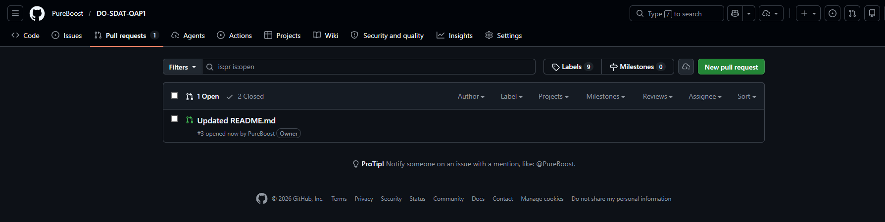
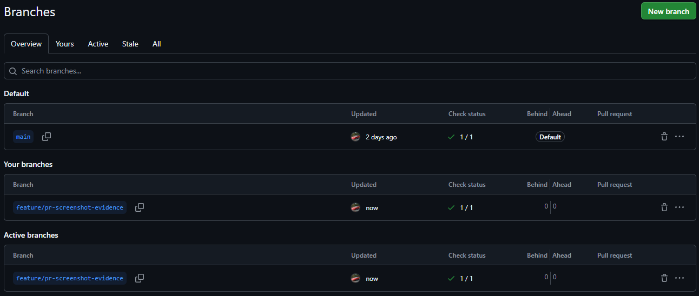

# Event Booking System

A simple Java console application for managing events and attendees.

## Features

- Create events with a name and capacity
- Add attendees to events
- Prevent duplicate attendees (by email)
- Enforce event capacity limits
- Remove attendees from events
- Search for events by name

## Tech Stack

- Java
- Maven
- JUnit 5

## Project Structure

- `Event` - Handles event data and attendee logic
- `Attendee` - Represents a person attending an event
- `EventService` - Stores and manages events
- `Main` - Console menu system

## How to Run

1. Clone the repository
2. Open in IntelliJ
3. Run `Main.java`

## Tests

The project includes 10 JUnit tests. Run tests with:

```bash
mvn test
```

## Clean Code Examples

Here are three examples from this project showing clean code practices:

- **Single Responsibility:** `Event` encapsulates event data and attendee management in one place. See [src/main/java/com/keyin/Event.java](src/main/java/com/keyin/Event.java) for the implementation.

- **Meaningful Names:** Methods like `addAttendee()` and `removeAttendee()` clearly express intent; class names `Event`, `Attendee`, and `EventService` are domain-focused. See [src/main/java/com/keyin/EventService.java](src/main/java/com/keyin/EventService.java).

- **Small, testable methods / explicit return values:** `addAttendee()` returns a `boolean` to indicate success/failure rather than throwing for expected business conditions, making behavior easier to test. See [src/main/java/com/keyin/Event.java](src/main/java/com/keyin/Event.java).

## GitHub Actions

- Added after inital commit
- https://github.com/pureboost/DO-SDAT-QAP1/actions/workflows/maven.yml


## Branching & PR Evidence

- **PR:** 
- **BRANCH:** 